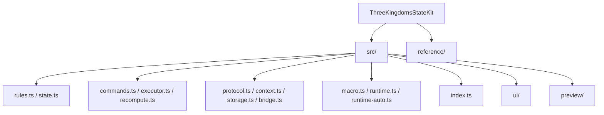

# ThreeKingdomsStateKit - 项目总览文档

## 项目愿景

ThreeKingdomsStateKit 是《三国霸主系统》角色卡的配套脚本库，目标是在 SillyTavern 一类宿主环境中提供一套可持久化、可注入上下文、可视化展示的状态系统。

核心能力包括：
- 结构化状态定义与创建（世界、主角、势力、城池、军队、NPC、任务、商城等）
- AI 回复协议解析与命令执行
- 基于 assistant 楼层 `data` 字段的状态快照持久化
- Vue 浮动系统界面与玩家选项交互
- `{{sgbz_context}}` 宏注入

---

## 架构总览

本项目为单包 TypeScript 工程，源码位于 `src/`，通过 tsup + unplugin-vue 打包为浏览器可用的单文件 ESM 产物 `dist/index.js`。

### 当前宿主依赖

运行时会优先从 `globalThis` / `window` / `TavernHelper` 获取宿主能力，常见接口包括：

| 宿主接口 | 用途 |
|---|---|
| `getChatMessages` / `setChatMessages` | 读写聊天楼层与快照 |
| `eventOn` / `eventRemoveListener` | 订阅与取消宿主事件 |
| `tavern_events.*` | `MESSAGE_RECEIVED` / `MESSAGE_SENT` / `MESSAGE_DELETED` / `CHAT_CHANGED` |
| `getButtonEvent(name)` | 获取快速回复按钮事件名 |
| `registerMacroLike` | 注册 `{{sgbz_context}}` 宏 |
| `triggerSlash` / `executeSlashCommandsWithOptions` | 填充输入框时优先走 slash |
| `toastr` | 非必需的提示通知 |
| `initializeGlobal` | 可选的全局对象挂载辅助 |
| `SillyTavern.*` | 读取聊天 ID、角色卡 ID、用户名等上下文 |

补充：项目依赖里包含 `lodash`，但源码运行时约定继续通过全局 `_` 使用。

---

## 模块结构图



说明：根文档只保留高层概览；更细的职责说明以下级 `CLAUDE.md` 为准。

---

## 模块索引

| 模块路径 | 职责概述 |
|---|---|
| `src/state.ts` | 状态类型定义与 `create*` 工厂函数 |
| `src/rules.ts` | 枚举、常量、等级映射与数值计算 |
| `src/commands.ts` | 命令类型、字段白名单与运行时校验 |
| `src/executor.ts` | 命令执行与派生字段统一重算 |
| `src/recompute.ts` | `_` 前缀派生字段重算 |
| `src/protocol.ts` | 解析 `<UpdateVariable>` 与 `<PlayerOptions>` |
| `src/storage.ts` | 聊天楼层状态快照读写 |
| `src/context.ts` | 构建注入 AI 的只读上下文 |
| `src/bridge.ts` | 串联协议解析、命令执行、存储与正文更新 |
| `src/macro.ts` | 注册 `{{sgbz_context}}` |
| `src/runtime.ts` | 运行时事件接线、UI 同步、玩家选项填充 |
| `src/runtime-auto.ts` | 自动注册钩子与按钮 |
| `src/ui/` | Vue 浮动系统界面、玩家选项窗、NPC 详情窗 |
| `src/preview/` | 本地开发预览入口与 mock 数据 |
| `reference/` | 宿主 API 参考与示例 |

---

## 运行与开发

### 环境要求

- Node.js（推荐 20+）
- pnpm 或 npm（当前仓库已有 `package-lock.json` 与 `pnpm-lock.yaml`）

### 常用命令

```bash
npm run typecheck
npm run build
npm run dev:preview
```

说明：
- `typecheck` 使用 `vue-tsc --noEmit`
- `build` 输出 `dist/index.js`
- `dev:preview` 用于本地预览，不参与宿主生产注入

### 在宿主中使用

将 `dist/index.js` 注入角色卡脚本或等效宿主脚本入口。脚本加载后会：
1. 挂载 `window.ThreeKingdomsStateKit`
2. 尝试注册 `{{sgbz_context}}` 宏
3. 自动接线 runtime 钩子与调试/系统界面按钮

---

## 数据模型总览

顶层结构 `状态总表`：

```text
状态总表
├── meta
├── 世界
├── 主角
├── 势力        Record<string, 势力>
├── NPC         Record<string, NPC>
├── 任务         Record<string, 任务>
└── 商城         Record<string, 商品条目>
```

当前一些关键模型约定：
- `_` 前缀字段均为只读派生字段，AI 不得直接写入
- `主角.物品栏` 为 `Record<string, { 物品, 数量 }>`
- `商品条目` 为 `{ 物品, 分类, 价格 }`
- `物品条目` 内可选嵌套 `装备条目`
- `任务状态` 当前为：`可接取 / 进行中 / 已完成 / 已失败 / 已过期`

---

## AI 回复协议

当前协议格式：

```text
<UpdateVariable>
<Analysis>
...
</Analysis>
<Commands>
[ { "type": "..." } ]
</Commands>
</UpdateVariable>

<PlayerOptions>
[ { "text": "..." } ]
</PlayerOptions>
```

支持命令共 **20** 种，覆盖世界、主角、势力、城池、军队、NPC、任务、商城等更新路径。

补充：
- assistant 消息正文中不再注入旧状态栏 HTML
- `<PlayerOptions>` 文本当前仍保留在正文里，由宿主或 UI 层自行处理显示/隐藏

---

## 当前前端架构说明

当前前端已全面转为 Vue 浮层模式：
- 可视 UI 由 `src/ui/` 承担
- 系统界面默认隐藏，通过按钮 `系统界面开关` 手动显示
- 玩家选项显示为独立悬浮窗
- NPC 详情支持独立多窗口浮层
- 聊天切换时会清理 UI，并按当前聊天恢复状态
- `pagehide` 场景下会执行统一 teardown，避免 iframe 中残留监听

换言之，旧的消息正文状态栏/玩家选项 HTML 方案已不再是当前实现的一部分。

---

## 测试与验证

当前仓库没有独立的自动化单元测试框架；开发时至少执行：

```bash
npm run typecheck
npm run build
```

另外可通过：
- 宿主环境手动验证交互
- `window.ThreeKingdomsStateKit.setDebug(true)` 开启日志
- `解析命令` 快速回复按钮手动触发解析
- `npm run dev:preview` 在本地预览 UI

---

## 编码规范

- 语言：TypeScript strict 模式，目标 ES2020
- 模块格式：ESM（`"type": "module"`）
- 业务领域类型和函数命名以中文为主
- `_` 前缀字段只能由 `recompute.ts` 写入
- 状态修改应优先经过 `create*` 工厂函数
- 新增枚举值需同步更新 `rules.ts` 与相关校验/提示词描述
- 不直接手改 `dist/`
- 宿主接口接入优先使用 duck-typing 检查

---

## AI 使用指引

1. 不要让 AI 直接写 `_` 前缀派生字段。
2. 新增命令时，至少同步 `commands.ts`、`executor.ts`，必要时同步 `index.ts`、提示词格式与上下文。
3. 结构变更时同步检查 `state.ts`、`recompute.ts`、`commands.ts`、UI 面板与 `prompts/命令输出格式.yaml`。
4. 文档更新时，优先维护离改动最近的 `CLAUDE.md`。
5. 若改动影响 runtime、正文写回、宿主交互，要特别确认聊天切换与恢复链路未被破坏。

---

## 变更记录 (Changelog)

| 时间 | 描述 |
|---|---|
| 2026-03-15 | 同步当前架构：移除旧消息正文状态栏描述，补充 Vue 浮层、NPC 详情窗、runtime 自动恢复、preview 与现行数据模型说明 |
| 2026-03-14 | 文档初始化 |
