# ThreeKingdomsStateKit - 项目总览文档

## 项目愿景

ThreeKingdomsStateKit 是《三国霸主系统》角色卡（SillyTavern AI 聊天角色扮演）的配套脚本库。

其核心目标是：以 TypeScript 编写、打包为浏览器可用 ESM JS 库，挂载到 `window.ThreeKingdomsStateKit` 全局对象，为 SillyTavern 等 AI 聊天前端提供：

- 结构化状态定义与创建（世界观、主角、势力、城池、军队、NPC、任务、商城等）
- AI 回复协议解析（从 AI 返回的文本中提取命令块并应用到游戏状态）
- 状态持久化（将状态快照写入聊天楼层的 `data` 字段，跨楼层断点续读）
- 状态面板渲染（Vue 3 浮动“系统界面”，默认隐藏，按需打开）
- 玩家选项交互（在独立 Vue 玩家选项悬浮窗中展示并点击填充输入框）
- 宏注入（将当前状态序列化注入为 SillyTavern 宏 `{{sgbz_context}}`）

---

## 架构总览

本项目是**单包结构**（Monorepo 无多子包），所有源码位于 `src/` 目录，以 TypeScript 编写，通过 tsup + unplugin-vue 打包为单一 ESM bundle（`dist/index.js`）。

运行时依赖宿主页面（SillyTavern）提供以下全局接口：

| 宿主接口 | 用途 |
|---|---|
| `getChatMessages` / `setChatMessages` | 读写聊天楼层状态 |
| `eventOn` / `eventRemoveListener` | 订阅/取消 SillyTavern 事件 |
| `tavern_events.MESSAGE_RECEIVED` | AI 回复完成事件 |
| `getButtonEvent(name)` | 获取快速回复按钮事件名 |
| `registerMacroLike` | 注册自定义宏 |
| `triggerSlash` / `executeSlashCommandsWithOptions` | 执行斜杠命令 |
| `TavernHelper.*` | 上述接口的备用来源 |
| `toastr` | Toast 通知（可选） |
| `_` (lodash) | 全局 lodash 依赖（由宿主提供） |
| `initializeGlobal` | 初始化全局挂载（由宿主提供，可选） |

---

## 模块结构图

```mermaid
graph TD
    A["(根) ThreeKingdomsStateKit"] --> B["src/ - 源码"]
    B --> C["state.ts - 数据类型与工厂函数"]
    B --> D["rules.ts - 枚举、常量与计算规则"]
    B --> E["commands.ts - 命令类型定义与校验"]
    B --> F["executor.ts - 命令执行引擎"]
    B --> G["recompute.ts - 派生字段重算"]
    B --> H["protocol.ts - AI 回复协议解析"]
    B --> I["bridge.ts - 高阶流程编排"]
    B --> J["storage.ts - 状态持久化"]
    B --> K["context.ts - 上下文注入构建"]
    B --> L["runtime.ts - SillyTavern 运行时接线"]
    B --> M["runtime-auto.ts - 自动接线入口"]
    B --> N["macro.ts - 宏注册"]
    B --> O["debug.ts - 调试日志"]
    B --> P["dom-host.ts - 宿主文档桥接"]
    B --> S["index.ts - 入口与全局挂载"]
    B --> UI["ui/ - Vue 双悬浮窗系统"]
    UI --> UA["app.ts - 挂载/样式注入"]
    UI --> USR["SystemUiRoot.vue - 根组件"]
    UI --> US["store.ts - 响应式共享状态"]
    UI --> UDrag["drag.ts - 定位与拖拽"]
    UI --> UViews["views/"]
    UViews --> UVP["UnifiedPanel.vue - 系统界面主窗"]
    UViews --> UVO["PlayerOptionsFloatingPanel.vue - 玩家选项悬浮窗"]
    UI --> UComps["components/"]
    UComps --> UCP["PlayerOptionsPanel.vue"]
    UComps --> UCS["StatusBarPanel.vue"]
    A --> REF["reference/ - SillyTavern 类型参考与示例"]

    click C "./src/CLAUDE.md" "查看 src 模块文档"
    click UI "./src/ui/CLAUDE.md" "查看 ui 模块文档"
```



---

## 模块索引

| 模块路径 | 职责概述 |
|---|---|
| `src/state.ts` | 所有游戏实体的 TypeScript 类型定义 + 带数据清洗的工厂函数（create*） |
| `src/rules.ts` | 游戏规则枚举（品质、阵型、剧本等）、常量表格、等级转换函数、数学计算工具 |
| `src/commands.ts` | 状态命令 union type、字段白名单校验、命令输入解析 |
| `src/executor.ts` | 逐条执行命令并修改状态，可选同步保存到楼层 |
| `src/recompute.ts` | 由基础字段重算所有 `_` 前缀派生字段（战力、伤势、等级称号等） |
| `src/protocol.ts` | 解析 AI 回复文本中的 `<UpdateVariable>` 命令块与 `<PlayerOptions>` 选项块 |
| `src/bridge.ts` | 将协议解析 + 命令执行 + 存储 + 正文清理串联为高阶 API，并把最新状态交给运行时同步到系统界面 |
| `src/storage.ts` | 读写聊天楼层 `data` 字段以持久化状态快照，管理过期清理与正文更新 |
| `src/context.ts` | 构建注入 AI 提示词的上下文 JSON 文本（只读视图，过滤不相关 NPC/任务） |
| `src/runtime.ts` | 挂载/卸载 SillyTavern 事件钩子、按钮钩子、玩家选项点击处理、系统界面控制 |
| `src/runtime-auto.ts` | 库加载时自动调用 runtime 注册逻辑（try-catch 静默失败） |
| `src/macro.ts` | 注册 `{{sgbz_context}}` 宏，拦截时动态返回当前状态注入文本 |
| `src/debug.ts` | 分级日志（`debugLog`/`debugInfo`/`debugWarn`/`debugError`），可运行时开关 |
| `src/dom-host.ts` | 获取宿主页面 document/window，解决 iframe 沙箱中的挂载与交互问题 |
| `src/index.ts` | 统一导出 + 组装 `ThreeKingdomsStateKit` 命名空间对象 + 全局挂载 |
| `src/ui/` | Vue 3 浮动系统界面（状态信息 + 玩家选项），挂载为独立 DOM 节点 |
| `reference/` | SillyTavern 宿主 API 类型参考文件与角色卡示例（不参与构建） |

---

## 运行与开发

### 环境要求

- Node.js（推荐 20+）
- pnpm

### 安装依赖

```bash
pnpm install
```

### 构建产物

```bash
pnpm build
```

构建产物输出至 `dist/index.js`（ESM 格式，浏览器平台，目标 ES2020）。
当前宿主兼容方案不依赖额外 `dist/index.css`，UI 样式随 JS 运行时注入宿主页面。

构建工具链：tsup + esbuild + unplugin-vue（Vue SFC 编译器）。

### 类型检查

```bash
pnpm typecheck
```

使用 `vue-tsc` 对 `src/**/*.ts` 和 `src/**/*.vue` 进行类型检查（不输出文件）。

### 在 SillyTavern 中使用

将 `dist/index.js` 的内容作为角色卡脚本（TavernHelper 脚本或世界书脚本）注入。
脚本加载后会自动在 `window.ThreeKingdomsStateKit` 挂载全局对象，并自动注册事件钩子。

---

## 数据模型总览

顶层状态结构（`状态总表`）：

```
状态总表
├── meta          { schemaVersion, scriptVersion, updatedAt }
├── 世界          { 当前时间, 当前地点, 当前剧本, 天气, 近期事件[] }
├── 主角          角色战斗数据 + 物品栏 + 声望/金钱/积分/官职/爵位/后宫和谐度
├── 势力          Record<string, 势力>
│   └── 势力      { 名称, 规模, 正统性, 情报网, 金钱, 粮草, 城池, 军队, 外交, 政策 }
├── NPC           Record<string, NPC>
│   └── NPC       { 名称, 品质, 阵营, 定位, 好感, 简述, 羁绊, 角色数据?, 武将信息?, 美人属性? }
├── 任务          Record<string, 任务>
└── 商城          Record<string, 商品条目>
```

以 `_` 前缀开头的字段（如 `_综合战力`、`_伤势`）为只读派生字段，由 `recompute.ts` 自动计算，AI 不应直接修改。

---

## AI 回复协议

AI 回复文本中嵌入结构如下：

```
<UpdateVariable>
<Analysis>
（AI 自由分析文本）
</Analysis>
<Commands>
[ { "type": "...", ... } ]
</Commands>
</UpdateVariable>

<PlayerOptions>
[ { "text": "..." }, ... ]
</PlayerOptions>
```

支持的命令类型（共 20 种）：

| 命令 | 作用 |
|---|---|
| `UpdateWorld` | 更新世界状态 |
| `AppendRecentEvent` | 追加近期事件 |
| `UpdatePlayerBase` | 更新主角基础属性 |
| `AdjustPlayerResource` | 调整主角资源（支持 delta/set 模式） |
| `UpdateFaction` | 更新势力数据 |
| `UpsertCity` / `RemoveCity` | 增改/删除城池 |
| `AddCityFacility` / `RemoveCityFacility` | 城池设施管理 |
| `UpsertArmy` / `RemoveArmy` | 增改/删除军队 |
| `UpdateDiplomacy` | 更新外交关系 |
| `UpdatePolicy` | 更新政策 |
| `UpsertNpc` / `RemoveNpc` | 增改/删除 NPC |
| `UpdateNpcRelation` | 更新 NPC 好感/羁绊 |
| `UpsertQuest` / `RemoveQuest` / `UpdateQuestState` | 任务管理 |
| `UpsertShopItem` / `RemoveShopItem` | 商城管理 |

---

## 当前前端架构说明

当前版本（2026-03-14）已完成前端全面 Vue 化：

- assistant 消息正文只保留清理后的纯文本回复，不再附加 `<StatusBar>` 或 `<PlayerOptionsPanel>` 标记
- 旧 `status-panel.ts`、`player-options.ts`、`player-options-panel.ts` 已删除
- 前端唯一可视 UI 为宿主页面底部的 Vue 浮动“系统界面”与独立玩家选项悬浮窗
- 系统界面默认隐藏，由 `runtime-auto.ts` 自动注册的快速回复按钮 `系统界面开关` 手动开关显示
- AI 回复处理完成后只同步最新状态和玩家选项到 `src/ui/store.ts`，不会自动弹出系统界面
- 玩家选项显示在独立 Vue 玩家选项悬浮窗中，并通过 `handlePlayerOptionClick()` 填入宿主输入栏
- 系统界面内容区已用 Vue 重建旧版状态栏的一/二级页签布局与视觉，不再依赖旧 HTML 状态栏实现
- `src/dom-host.ts` 负责把挂载点、样式注入和交互访问桥接到宿主 document，解决 iframe 沙箱不可见问题
- `src/ui/drag.ts` 负责双悬浮窗的公共拖拽、居中定位和输入框上方定位逻辑
- `src/ui/SystemUiRoot.vue` 已替代过渡式 `root.ts` 作为正式 UI 根组件
- `src/ui/app.ts` 当前会将系统界面样式直接注入宿主 `document.head`，以兼容 SillyTavern 助手脚本只加载单个 `index.js` 的限制
- `src/ui/styles.css` 可作为样式源码参考，但宿主实际运行时不依赖额外加载 `index.css`
- `runtime.ts` 现已监听 `tavern_events.CHAT_CHANGED`，在聊天切换时自动清理悬浮窗 UI

---

## 测试策略

当前版本**无自动化测试**（无 Vitest / Jest 配置），测试通过以下手段进行：

- 在 SillyTavern 环境中加载脚本后手动触发场景验证
- 通过 `window.ThreeKingdomsStateKit.setDebug(true)` 开启详细日志进行调试
- 点击角色卡"解析命令"按钮手动触发对最新消息的处理

---

## 编码规范

- 语言：TypeScript strict 模式，目标 ES2020
- 模块格式：ESM（`"type": "module"`）
- 命名风格：业务类型名与函数名使用简体中文（如 `create主角`、`recompute势力`），英文用于工具函数和底层接口
- 字段保护：所有 `_` 前缀字段为只读派生字段，命令层校验中通过 `断言无下划线字段` 强制拒绝 AI 修改
- 全局依赖：`_`（lodash）和 `initializeGlobal` 通过 `global.d.ts` 声明为全局变量，由宿主注入
- 错误处理：运行时钩子注册使用 try-catch 静默失败，命令解析/执行层抛出异常并通过 `debugError` 记录

---

## AI 使用指引

在此项目中使用 AI 辅助开发时，请注意：

1. **不要修改 `_` 前缀字段**：这些是派生字段，只应在 `recompute.ts` 中赋值。
2. **命令新增流程**：在 `commands.ts` 的 union type 中新增命令类型 → 在 `commands.ts` 中添加校验分支 → 在 `executor.ts` 中添加执行分支 → 在 `index.ts` 导出（若需要）。
3. **状态修改必须经过工厂函数**：使用 `create*` 函数（来自 `state.ts`）确保数据合法性与默认值。
4. **枚举值须在 `rules.ts` 中声明**：`枚举` 对象的值数组同时用于运行时校验，新增枚举值需同步更新。
5. **不修改 `dist/`**：`dist/index.js` 是构建产物，应通过 `pnpm build` 重新生成。
6. **宿主接口适配**：`runtime.ts` 和 `storage.ts` 中的宿主接口通过 duck-typing 检测（检查 `typeof` 是否为 `'function'`），新增宿主接口调用时需遵循此模式。

---

## 变更记录 (Changelog)

| 时间 | 版本 | 描述 |
|---|---|---|
| 2026-03-14 | 文档初始化 | 通过 AI 架构师工具自动生成，覆盖全量源文件扫描 |
